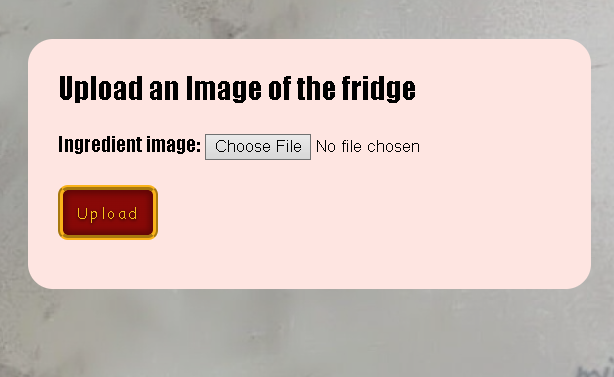

# User story title: [Upload Images to the web application.](https://trello.com/c/LkowQwUX)

## Priority: 7
 
## Estimation: 2 days 

## Description: User can upload images from their local device to the web application.

## Tasks 

1. Create an entity to store the uploaded images, <b>Estimation 6 hours</b>
2. Create the forms for uploading images using the entity that has been created. <b>Estimation 6 hours</b>
3. Create a way to push and pull the image data into and from the database entity. <b>Estimation 1 day</b>

# UI Design:
Mockup: 
 

# Completed:

## Iteration 1: 

## Iteration 2: 

## Iteration 3: 
*Developer Note: This user story was completed before sprint 3 or Iteration 3*

# Disclaimer
<i> Planning poker was played offline using actual fibonacci sequence cards </i>
