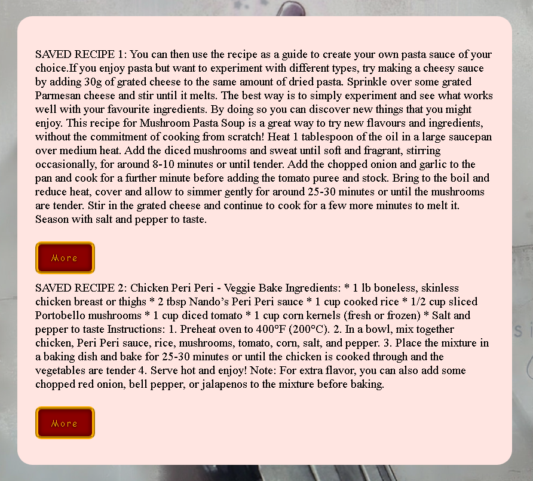

# User story title: [Browse Recipe.](https://trello.com/c/fzA3aT4A)

## Priority : 8

## Estimation: 3 days

## Description: User can upload images from their local device to the web application.

## Tasks 

1. Create an entity to store all these recipes within the database, **Estimations 1 day**
2. Create a way to pull the data from the database. **Estimations 1 day**
3. Create a way to display the data pulled from the recipe entity table, **Estimations 6 hours**
4. Create a way for the data that is pulled from the recipe entity table to be readable and displayable to users, **Estimations 6 hours**

# UI Design:
Mockup : 
 

# Completed:

## Iteration 2: 
 

## Iteration 3: 
 

# Disclaimer
<i> Planning poker was played offline using actual fibonacci sequence cards </i>