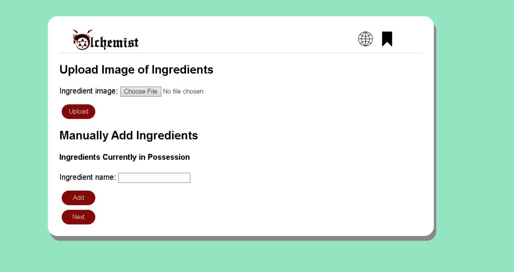

# User story title: [Manually Add Ingredients.](https://trello.com/c/s3rgBwRo)

## Priority: 8 

## Estimation: 3 days

## Description: User can add ingredients manually if needed.

## Tasks

1. Create an entity for the ingredients in the database, **Estimation 6 hours**
2. Create a way to push and pull ingredients into and from the database, **Estimation 6 hours**
3. Create the form for users to input the ingredients they want into the database, **Estimation 1 day**
4. Create a way for users to delete an ingredient they do not want anymore, **Estimation 1 day**

# UI Design:
Mockup:
 

# Completed:

## Iteration 1
*Developer note: This user story was not started until sprint 2 / iteration 2.*

## Iteration 2
 

## Iteration 3 
 

# Disclaimer
<i> Planning poker was played offline using actual fibonacci sequence cards </i>
