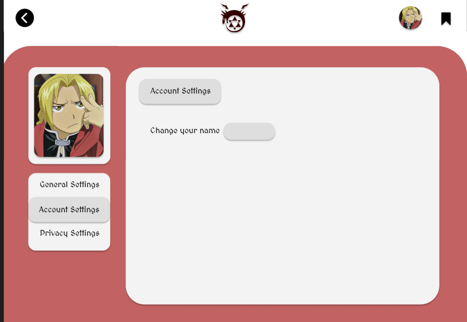
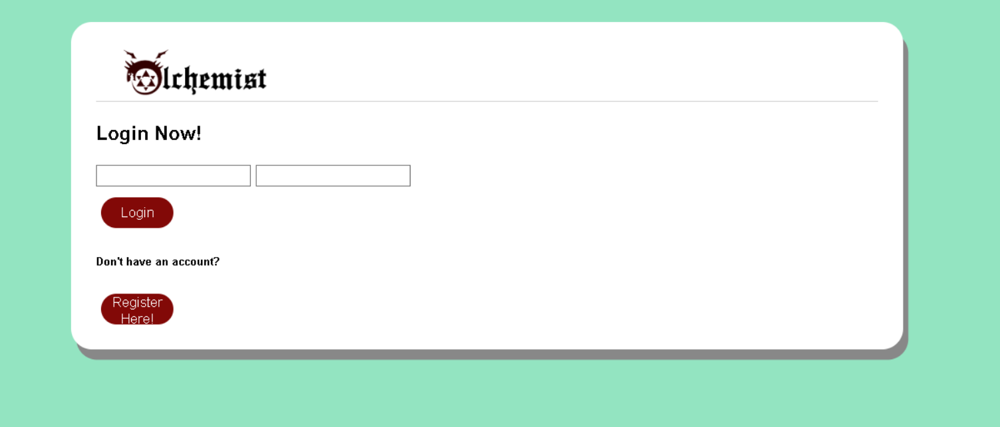
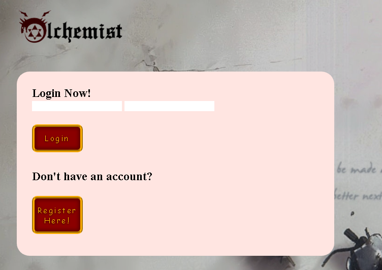

# User story title: [Login Page and Registration Page.](https://trello.com/c/jQ2l2UMR)

## Priority: 6

## Estimation: 2 days

## Description: User can sign up with their set credentials and login with them after setting them.

## Tasks

1. Create the database entity for storing user data, **Estimation 3 hours**
2. Create the backend code for authentication of inputted user data with stored user data, **Estimation 3 hours**
3. Ensuring that the usernames being registered are unique, **Estimation 1 hour days**
4. Piping the user ID of the user that has logged in into all of the pages, **Estimation 1 day**
5. Creating a way to push and pull data into and from the database entity containing the user data, **Estimation 3 hour**
6. Creating the form for creating new user data entries, **Estimation 2 hour**

# UI Design:
Mockup: 
 

# Completed:

## Iteration 1
*Developer Note: this user story was started in iteration 2*

## Iteration 2
 

## Iteration 3
 

# Disclaimer
<i> Planning poker was played offline using actual fibonacci sequence cards </i>