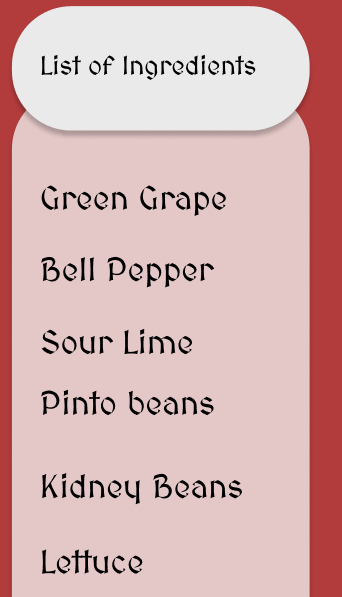
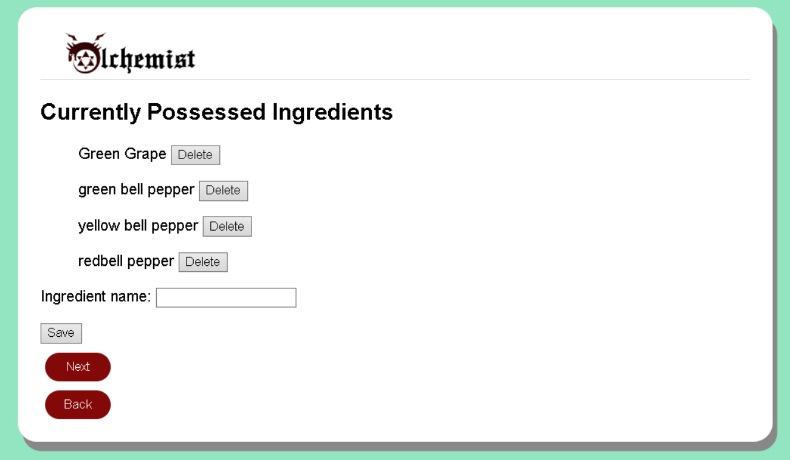
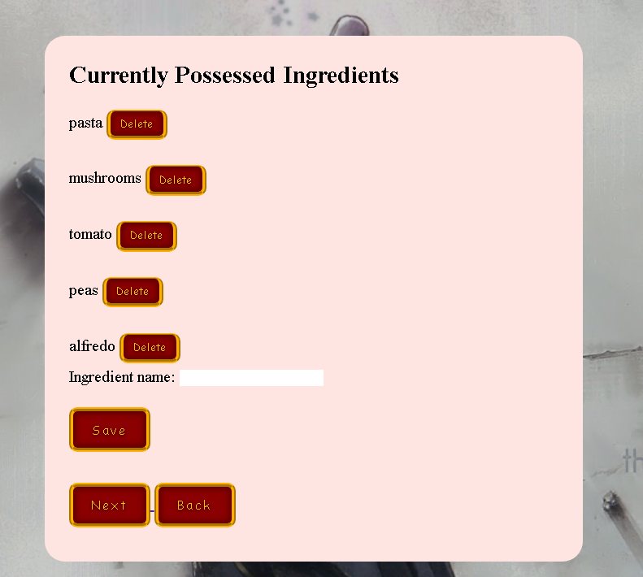

# User story title: [Ingredients compiled into a list.](https://trello.com/c/10btBkcc)

## Priority: 8

## Estimation: 3 days

## Description: User can review the list of ingredients before generating the recipe.

## Tasks

1. Get the ingredients detected by the object detection model, **Estimation 1 day**
2. Format the ingredients detected such that it is readable, **Estimation 6 hours**
3. Make it so that users will be able to add or delete any of the ingredients that has been detected, **Estimation 1 day**
4. Push all of the resulting ingredients into the database, **Estimation 6 hours**

# UI Design:
Mockup:
 

# Completed:

## Iteration 1
 

## Iteration 2
 

## Iteration 3
*Developer Note: This User Story was finished before sprint 3 / Iteration 3.*

# Disclaimer
<i> Planning poker was played offline using actual fibonacci sequence cards </i>