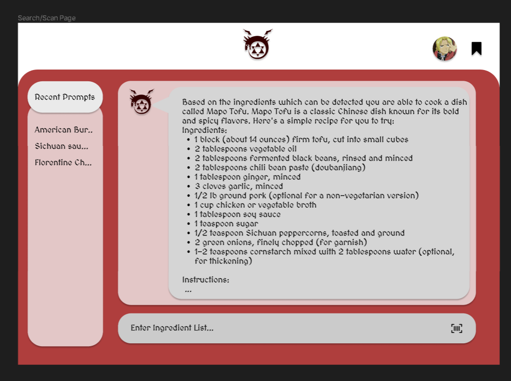
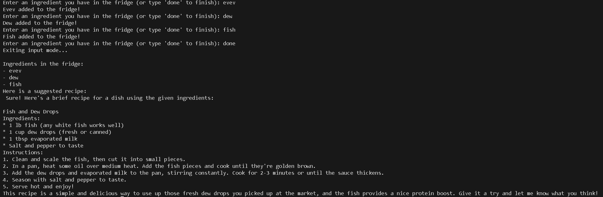
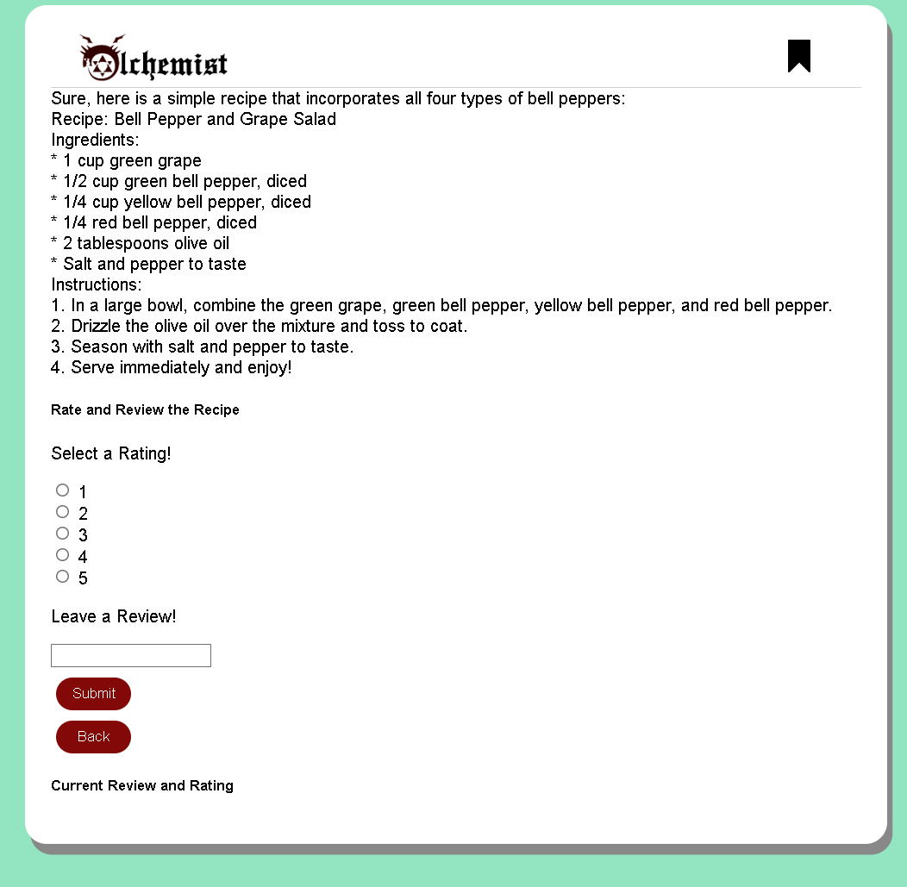
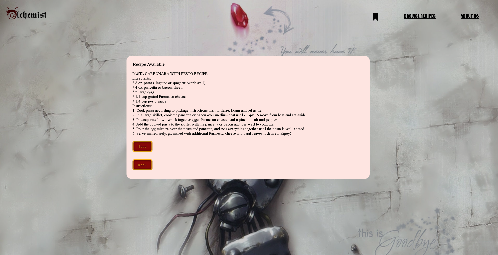

# User story title: [Implement a Large Language Model](https://trello.com/c/dpRsQXH5)

## Priority: 10

## Estimation: 6 days

## Description: The web site will utilize and be integrated with a large language model capable of taking an input of ingredients and turning it into a recipe that can b read by the user. This will involve training a large language model to be able to more effectively generate recipes.

## Tasks.

1. Understand the architecture and training methods, <b>Estimation 2 days</b>
2. Decide on the framework or platform to use for implementation (e.g., TensorFlow, PyTorch, Hugging Face)
<b>Estimation 1 day</b>
3. Gather a large dataset of text data for training the model, <b>Estimation 1 day</b>
4. Tokenize the text into smaller units (e.g., words, subwords, characters), <b>Estimation 4 hours</b>
5. Decide on the number of layers, hidden units, attention mechanisms, etc, <b>Estimation 3 hours</b>
6. Train the language model on the prepared dataset, <b>Estimation: 1 day</b>
7. Fine-tune hyperparameters to optimize performance, <b>Estimation: 3 hours</b>
8. Monitor training progress and adjust the model, <b>Estimation 1 day</b>

# UI Design:
Initial Mockup of the UI Design : 

# Completed:
## Iteration 1:

## Iteration 2:

## Iteration 3:
 

# Disclaimer
<i> Planning poker was played offline using actual fibonacci sequence cards </i>