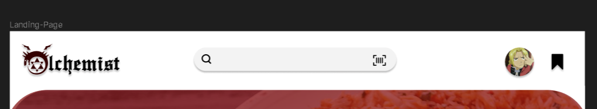
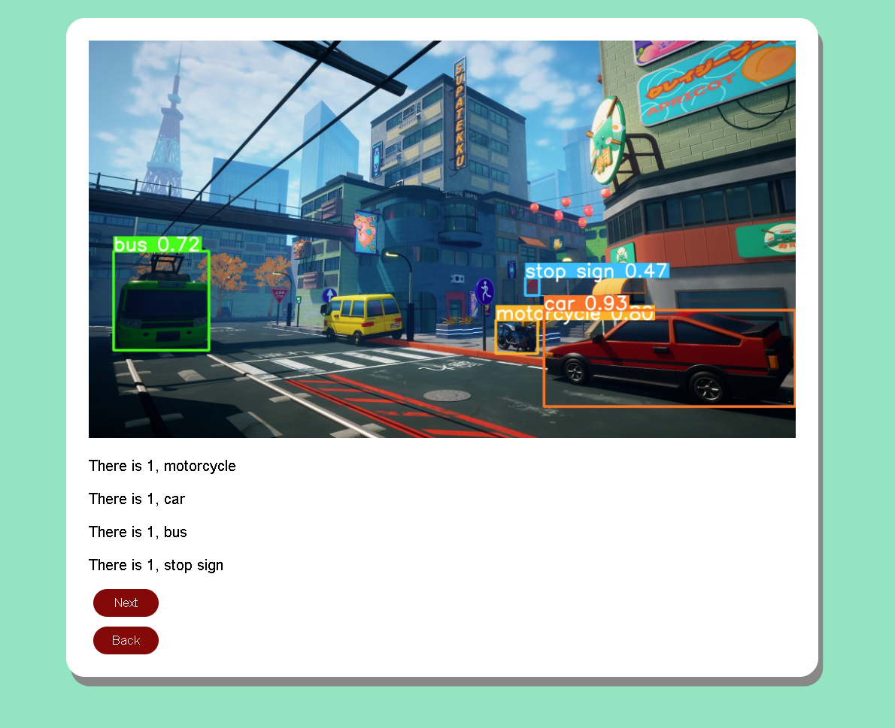
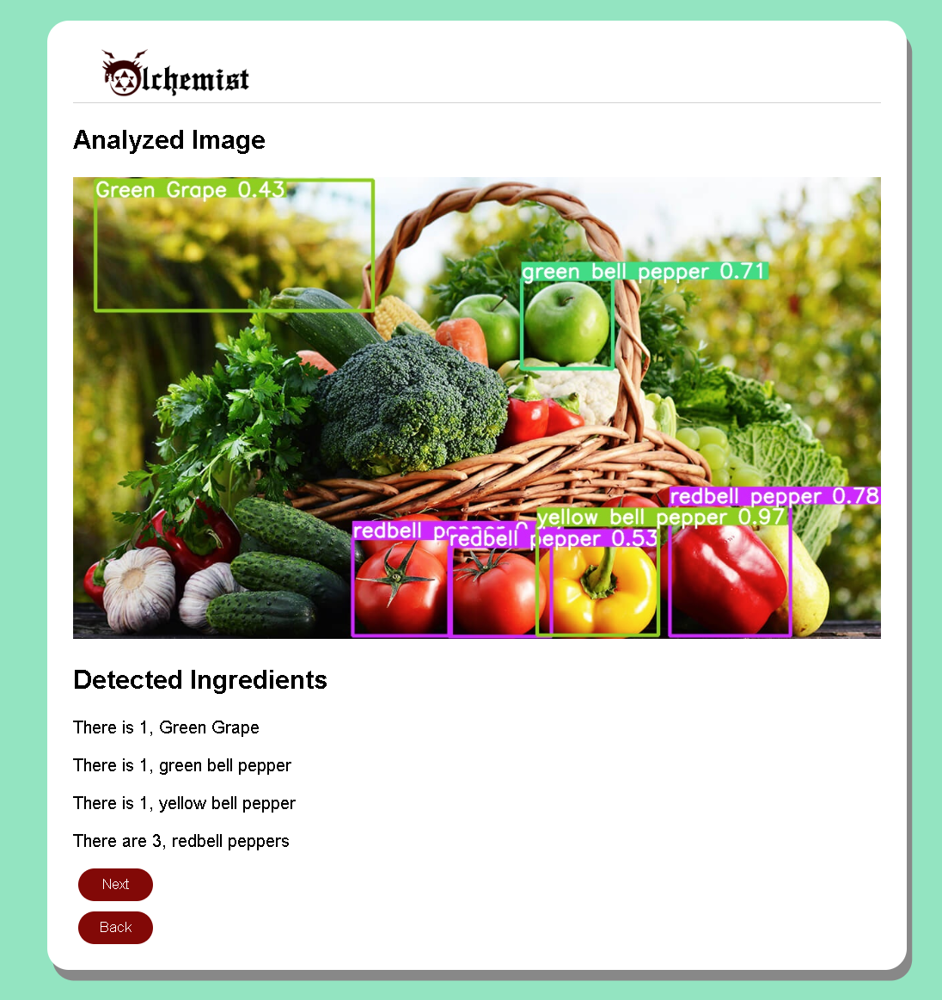
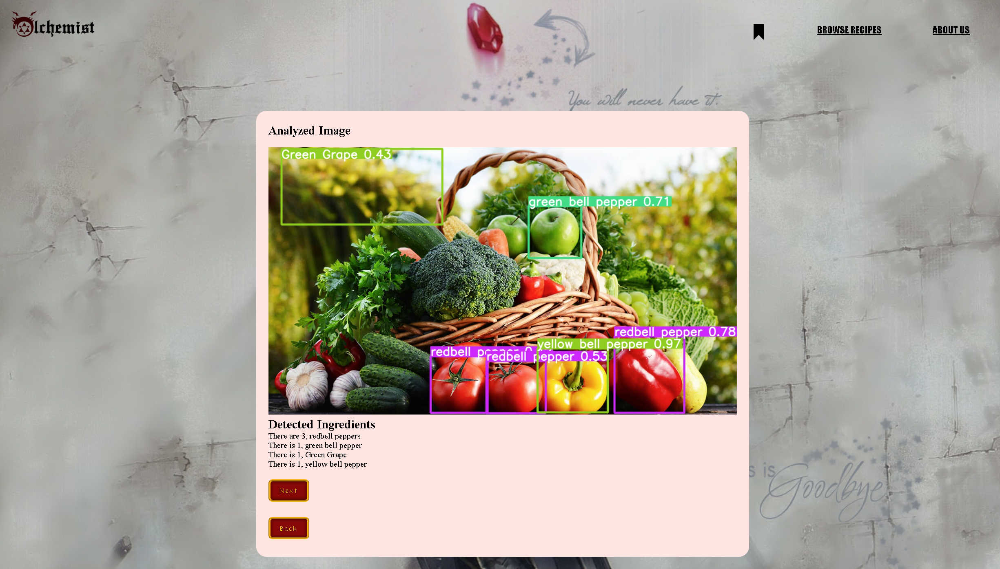

# User story title: [Implement an Object Recognitiion Model](https://trello.com/c/2CFaWiNU)

## Priority: 10

## Estimation: 5 days

## Description: The website will be able to take an image an detect all of the ingredients that are contained within the image, the program will then format the list of detected ingredients and pipe it into the LLM

## Tasks.

1. Task 1, Find a dataset that can be used to train a model to recognize ingredients, <b>Estimation: 1 day</b>
2. Task 2, Create code to actually train the model, <b>Estimation: 1 day</b>
3. Task 3, Train the model, <b>Estimation: 1 day</b>
4. Task 4, Test the weights created, <b>Estimation: 1 day</b>
5. Task 5, Create the code integration for the object detection model in the web application, <b>Estimation: 1 day</b>

# UI Design:
Mockup:  
*Developer note for the professor: This image might be a bit confusing but this search/lens bar is used as a mockup, you might have seen this type of scanning popularly used by google lens*

# Completed:
## Iteration 1:

## Iteration 2:

## Iteration 3:
 

# Disclaimer
<i> Planning poker was played offline using actual fibonacci sequence cards </i>