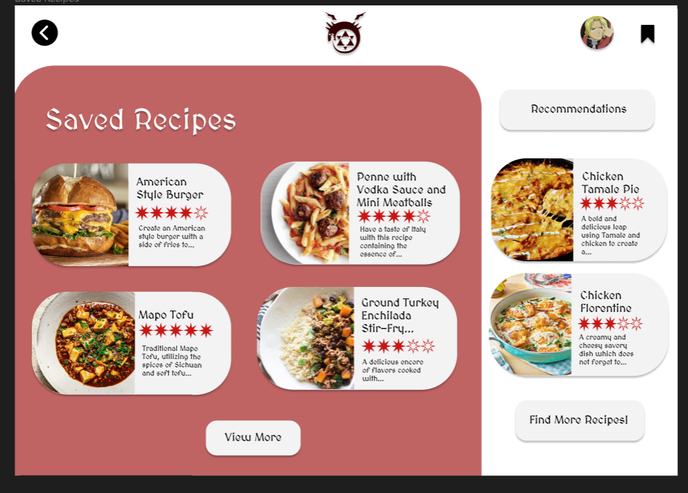

# User story title: [Rate and Review Recipe](https://trello.com/c/DwytdHzm)

## Priority: 7

## Estimation: 3 day

## Description: This will allow the user to leave a review and rating on a specific recipe

## Tasks, see chapter 4.

1. Create a way for the user to input a rating, **Estimation 2 hours**
2. Create a way for the user to input a review, **Estimation 2 hours**
3. Create a way to display the rating, **Estimation 1 hour**
4. Create a way to display the review, **Estimation 1 hour**
5. Create a way to store the rating of the user, **Estiamtion 1 day**
6. Create a way to associate the rating to a specific recipe, **Estimation 3 hours**
7. Create a way to store the review of the user, **Estimation 3 hours**
8. Create a way to associate the review to a specific revipe, **Estimation 3 hours**

# UI Design:
Mockup: 

# Completed:

## Iteration 1: 
*Developer note: this user story was started in sprint 2 meaning it was NOT a part of sprint 1 or Iteration 1*

## Iteration 2:

## Iteration 3:
 
 

# Disclaimer
<i> Planning poker was played offline using actual fibonacci sequence cards </i>