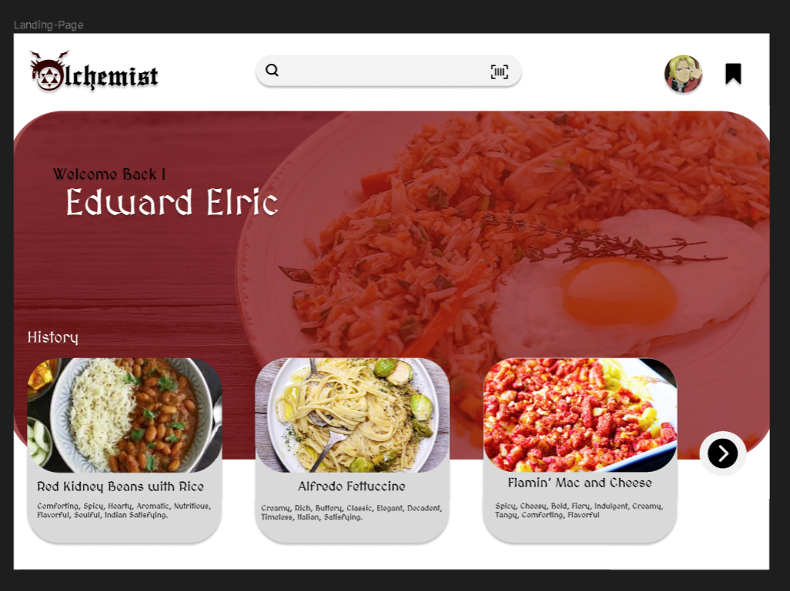
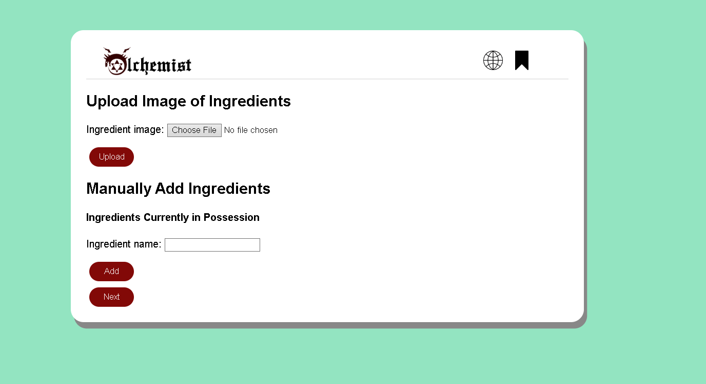
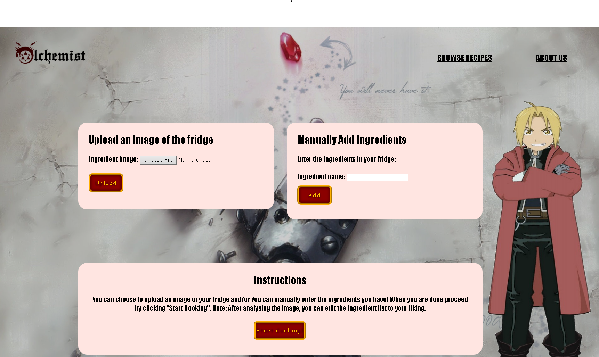

# User story title: [GUI and Theme](https://trello.com/c/29lyOrI1)

## Priority: 8 

## Estimation: 5 days

## Description: Ensure that the layout and formating of the pages and navigation is something that can be intuitively understood by a user.

## Tasks, see chapter 4.

1. Determine a suitable layout for our web application, **Estimation 2 days**
2. Optimize the layout to have a navigation flow that is user friendly, **Estiamtion 2 days**
3. Create a header that can be intuitively understood, **Estimation 1 day**

# UI Design:
Mockup: 

# Completed:

## Iteration 1:

## Iteration 2:
 

# Disclaimer
<i> Planning poker was played offline using actual fibonacci sequence cards </i>