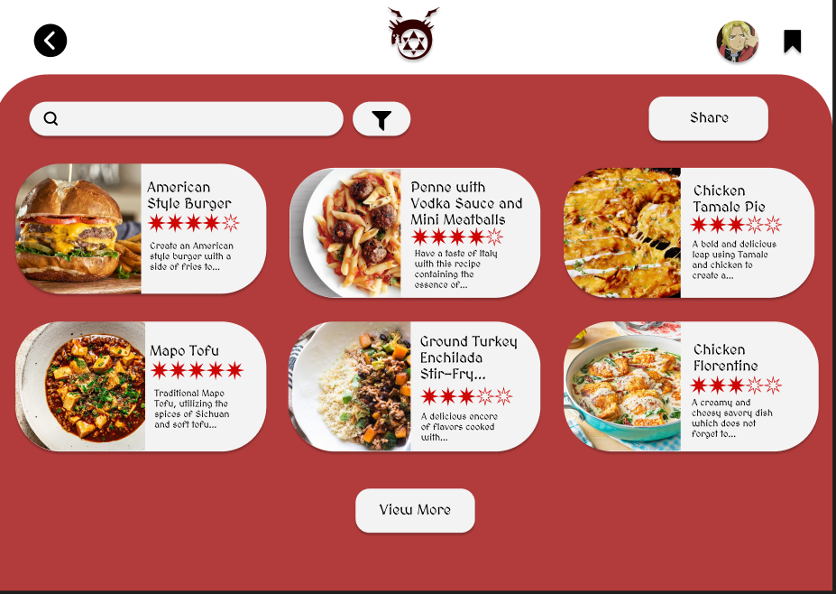

# User story title: [Save recipe](https://trello.com/c/4cQa3DTq)

## Priority: 8

## Estimation: 2 days

## Description: Users will be able to save recipes into their own personal account, letting them view all of the recipes that they have saved.

## Tasks.

1. Create a way for users to mark a recipe as favorited, **Estimation 1 day**
2. Create a way pull only recipes tagged as favorite from the database, **Estimation 1 day**

# UI Design:
Mockup:
 

# Completed:

## Iteration 1:

## Iteration 2:

 

# Disclaimer
<i> Planning poker was played offline using actual fibonacci sequence cards </i>