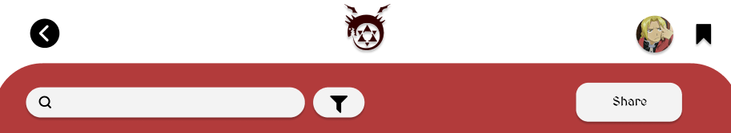

# User story title: [Share recipe](https://trello.com/c/4cQa3DTq)

## Priority: 2

## Estimation: 3 days

## Description: Users will be able to share their recipes in their social media

## Tasks.

1. Task 1, Find a way for the user to connect to their social media account from the web application, **Estimation 1 day**
2. Task 2, Create a way to format the recipes the user wish to share into the format of posts of the social media platform we are allowing them to share to, **Estimation 1 day**
3. Task 3, Create a database for this specific share posts, **Estimation 1 day**

# UI Design:
Mockup:

# Completed:
*Developer Notes: We did not have time to finish this user story :(*

# Disclaimer
<i> Planning poker was played offline using actual fibonacci sequence cards </i>